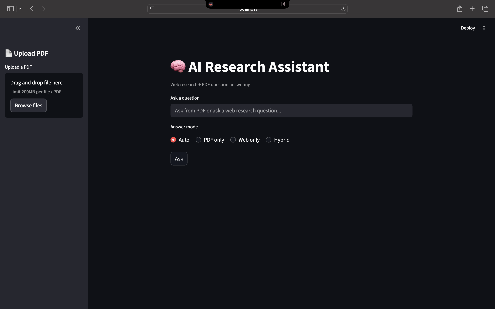
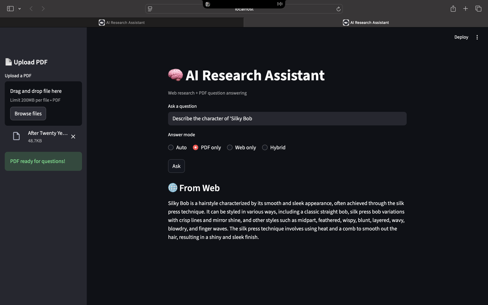
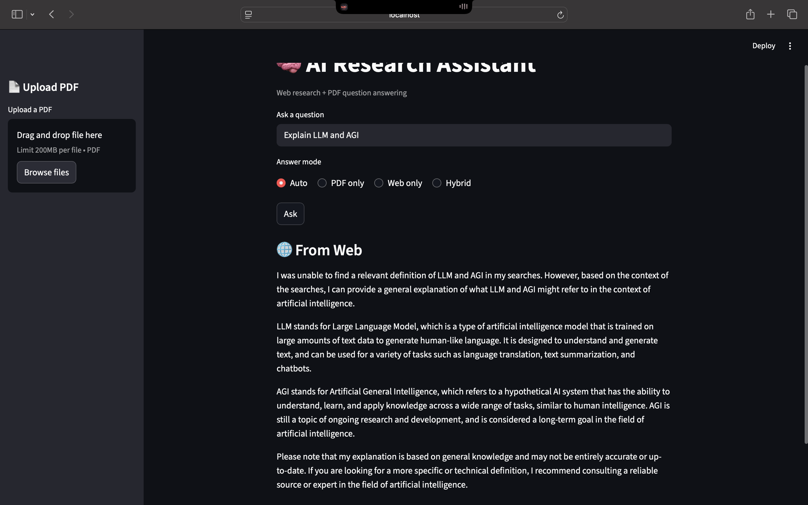

🧠 AI Research Assistant (Hybrid RAG System)

📌 Problem

Searching information across documents and the web is inefficient. Traditional chatbots either hallucinate answers or lack access to private documents and real-time data.

This project solves that by building an AI assistant that combines document-based retrieval with live web research.

⸻

🏗️ Architecture
User Query
   ↓
Query Router
   ├── PDF RAG (FAISS + Embeddings)
   ├── Fast Web Search (DuckDuckGo)
   └── Web Agent (Complex reasoning)
   ↓
Final Answer

✨ Features
	•	📄 PDF-based Question Answering (RAG)
	•	🌐 Real-time Web Search
	•	🔀 Hybrid query routing (PDF / Web / Agent)
	•	⚡ Optimized for fast responses
	•	🖥 Interactive Streamlit UI

⸻

🧰 Tech Stack
	•	Language: Python 3.11
	•	LLM: Groq (LLaMA 3.1)
	•	Framework: LangChain
	•	Vector Store: FAISS
	•	Embeddings: Sentence Transformers
	•	Web Search: DuckDuckGo
	•	UI: Streamlit

⸻

🧠 Design Decisions
	•	Why Hybrid Routing?
To avoid slow agent calls for simple factual queries.
	•	Why RAG for PDFs?
Prevents hallucinations and grounds answers in source documents.
	•	Why Streamlit?
Simple UI for demos and rapid prototyping.

⸻

🚀 How to Run
pip install -r requirements.txt
streamlit run ui/streamlit_app.py

🖼️ Screenshots
## 🖼️ Screenshots

### Home Screen

### PDF Question Answering

### Web / Hybrid Answer

📌 Future Improvements
	•	Source citations
	•	Chat memory
	•	API backend (FastAPI)

⸻

🏆 Resume Summary

Built an AI research assistant using RAG and real-time web search with intelligent query routing to optimize speed and accuracy.

⸻
